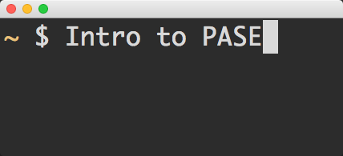
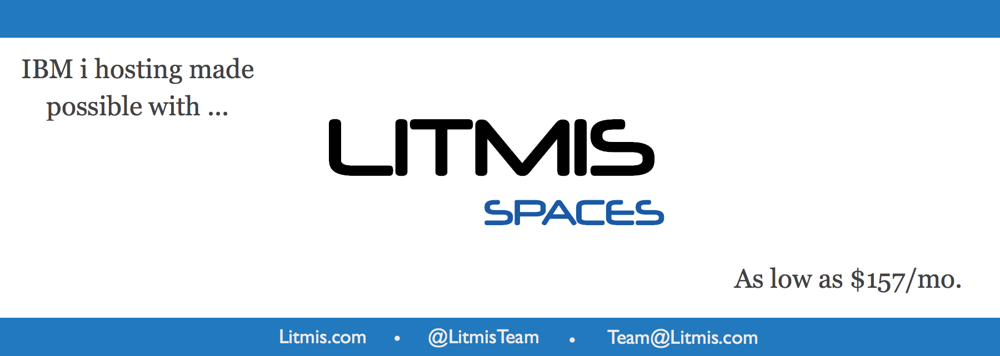

# Introduction

## Sponsor

[litmis.com](http://litmis.com/) \| [@litmisteam](https://twitter.com/litmisteam) \| [team@litmis.com](mailto:team@litmis.com)

## Table Of Contents

* [Introduction](./)
* [Step 1: What is PASE?](step-1-what-is-pase.md)
* [Step 2: The Shell](step-2-the-shell.md)
* [Step 3: Set up a LITMIS Space](step-3-set-up-a-litmis-space.md)
* [Step 4: Start a Shell Session](step-4-start-a-shell-session.md)
* [Step 5: Navigating the IFS](step-5-navigating-the-ifs.md)
* [Step 6: Shell Command Line Tips](step-6-shell-command-line-tips.md)
* [Step 7: The joe Editor](step-7-the-joe-editor.md)
* [Step 8: First Shell Script](step-8-first-shell-script.md)
* [Step 9: Configure Your Shell](step-9-configure-your-shell.md)
* [Step 10: The PASE Library List](step-10-the-pase-library-list.md)
* [Step 11: Configure upon login](step-11-configure-upon-login.md)
* [The End](the-end.md)

