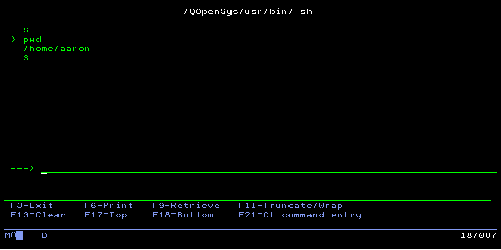
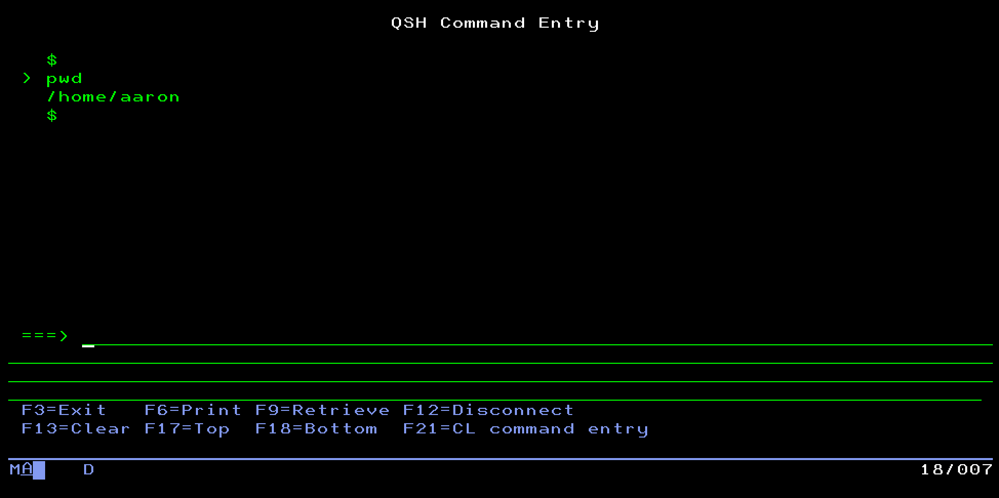
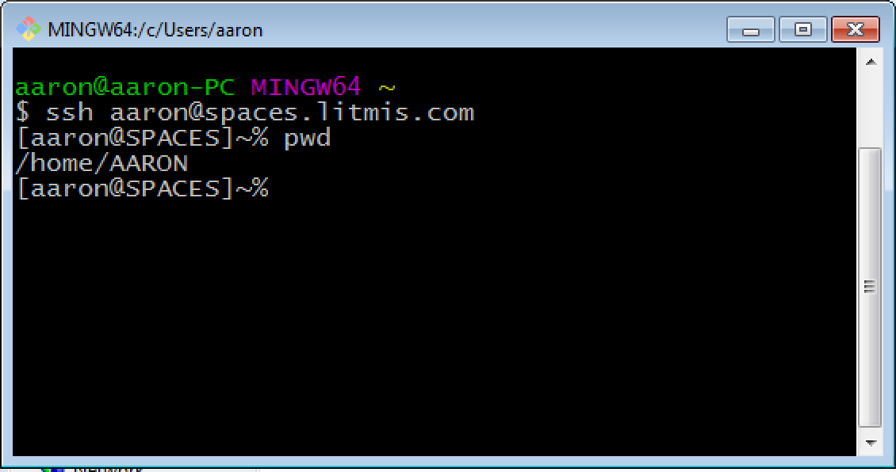
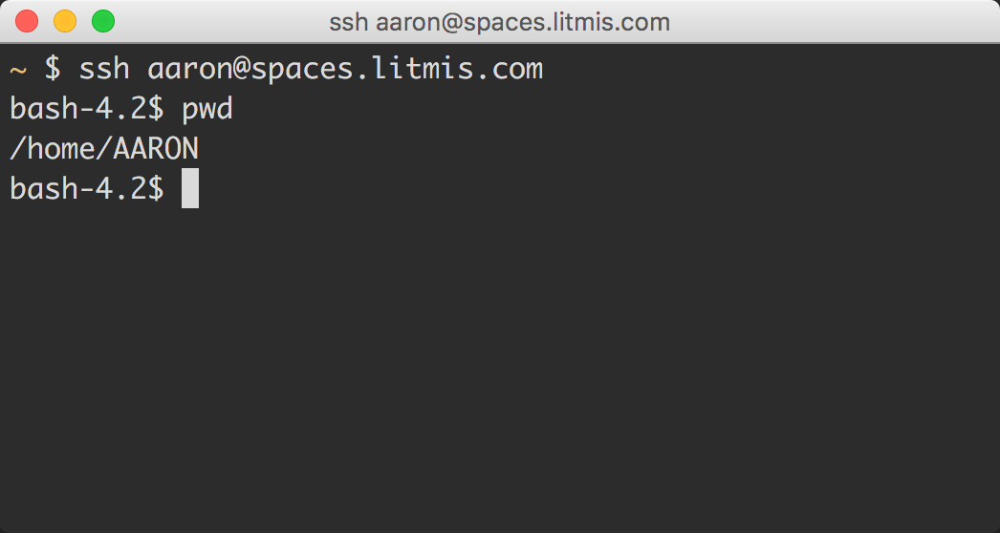

# Step 2: The Shell

**NOTE:** The following is commentary.  You will not be opening a 5250 session.  You will be doing some setup starting in step 3.

You access PASE using what's called a _shell_. A shell is an interface to the operating system. The [PASE](http://krengel.tech/ibmkn2ecba) shell is a lot like a 5250 telnet session; it's a program that takes your commands from the keyboard and hands them to the operating system to perform their associated action. It is also known as a CLI \(**C**ommand **L**ine **I**nterface\).

By default PASE uses the Korn Shell \(aka `ksh`\). One way you can enter into a PASE Korn Shell is via `CALL QP2TERM` from a 5250 Telnet session, as shown below.



The `pwd` \(**P**rint **W**orking **D**irectory\) command has been keyed in and the Enter key pressed. Under the covers the `pwd` C program is invoked, does its thing, and returns output back to your shell's screen. You can see the Linux documentation of `pwd` [here](http://krengel.tech/pwdpr6eb49).

## QP2TERM and QShell

If you've been on the IBM i for any amount of time you've probably been exposed to QShell. You can start a QShell session by typing QSH. You'll notice QShell looks **very** similar to `CALL QP2TERM`.



The primary difference between these two environments is that QShell is based on the ILE environment and `CALL QP2TERM` is based on AIX. For 99% of what you do you will stay away from QShell because it doesn't operate correctly in certain circumstances. The few scenarios you will use it involve starting a shell script from a 5250 session, as shown below. When you do this it will in turn enter into a real PASE shell.

```text
SBMJOB CMD(QSH CMD('/path/to/script.sh parm1 parm2'))
```

A significant amount of more information concerning PASE shells can be found on the [YiPs site](http://krengel.tech/yipsw77426) where Tony Cairns \(IBM'er at Rochester\) goes deep and wide on a variety of PASE topics.

## A Better Shell

Ok, we now know QShell should be used in limited fashion, and that getting to the Korn shell \(ksh\) via `CALL QP2TERM` is better, but it still isn't the best.

Instead what you should be using is a more feature rich shell, like `bash`. The Bourne Again Shell \(bash\) is now available with the port of the [Yum package manager](http://krengel.tech/ibmioss-rpms).

**Why is Bash better?**

* **Tab key to complete.** Instead of fully typing a directory or file name you can hit the `tab` key and it will auto complete it.
* **Short-cut keys.** For example, `Ctrl + A` and `Ctrl + E` go to the beginning and end of the current line, respectively. More on this later.
* **Custom Prompt.** Bash allows you to customize your prompt to include things like the current directory, the current user. i.e. `[aaron@SPACES]/home/aaron/git$`

The other thing you need to know is that, while bash works in `QP2TERM`, it is fairly crippled. For example, the tab-to-complete and short-cut keys don't work in `QP2TERM` because it isn't what called a teletypewriter \(TTY\) type terminal. To get a TTY terminal we need to start the `*SSHD` \(SSH Daemon\) _\(n1\)_ server and then use a client-side program \(on the desktop\) to connect to a bash shell on IBM i.

Once the `*SSHD` TCP server is started you can then connect to it using a terminal client, as shown below on Windows using [Git Bash](http://krengel.tech/gitfo507c2).



Or on a Mac using [iTerm2](https://www.iterm2.com).



Stay tuned for how you'll access the PASE shell for this lab.

### Please proceed to the next step.

n1: `STRTCPSVR *SSHD`

