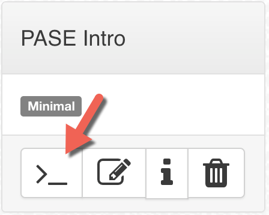
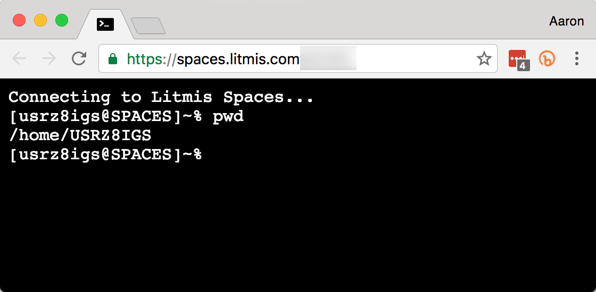

# Step 4: Start a Shell Session

Starting a shell session on Litmis Spaces is simple - simply select the below button and a new browser tab will open.

Once the tab has finished loading you should see something similar to the following.

**What just happened?**

You're on a web page that is communicating with an IBM i job. That IBM i job has the PASE runtime started so you can run a shell and submit commands and run programs in it.

You'll notice the prompt shows a `%` instead of `$`. That's because Litmis Spaces makes use of the Zsh shell instead of bash - personal preference.

An IBM i user profile has been automatically created for you. You can see it in both the command prompt \(i.e. `[usrz8igs@SPACES]~%`\) and by way of the `pwd` command.

By running the `pwd` \(print working directory\) command we learn that when we log into PASE we're put into our "home" directory, which is `/home/USRZ8IGS` for this user. Think of this as being similar to how Windows Explorer works. When you open Windows Explorer, you can click on directories and go inside of them. The directory you are inside of is considered your "working directory".

The Zsh shell allows us to configure what the prompt contains. In this case it first has an open bracket \(`[`\), the IBM i user profile \(`usrz8igs`\), an `@` symbol, the system name \(`SPACES`\), and the current directory location that your shell is inside of \(`~`\). The tilde \(`~`\) is a short-cut that points at the current user's home directory; `/home/USRZ8IGS` in this case.

For brevity's sake this lab will use `~%` for the shell prompt from here on out.

## Please proceed to the next step.

